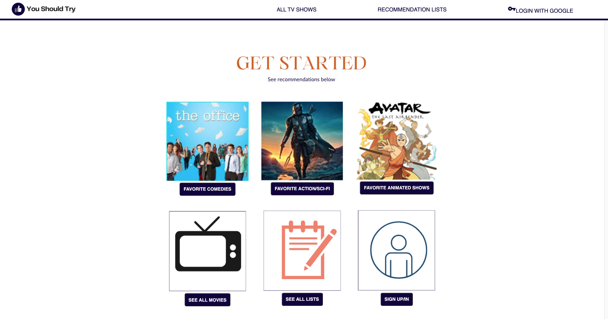
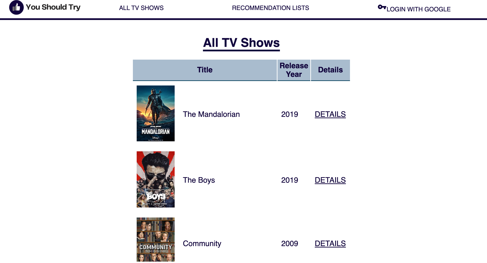
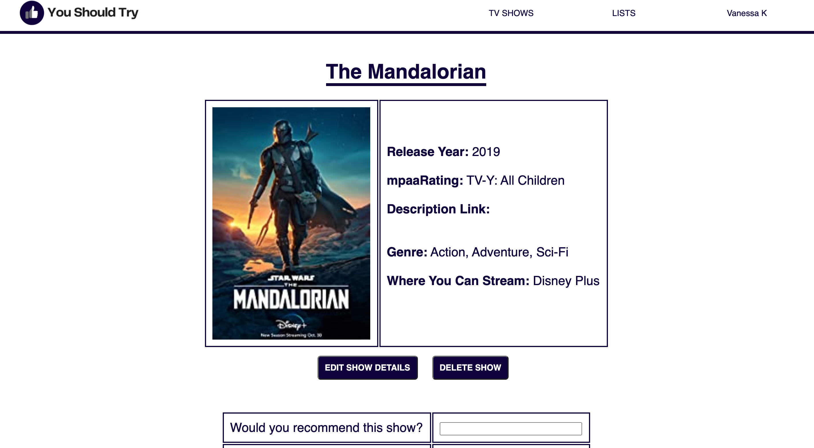
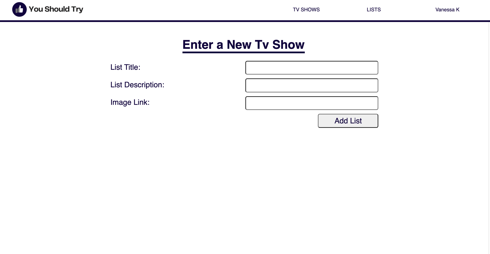
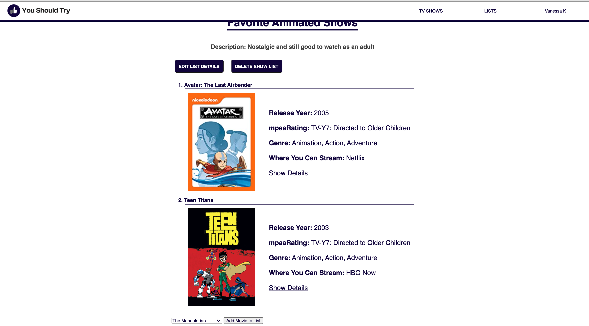

# You Should Try App (Media Recommender)
---
## Table of Contents

* [About the Project](#about-the-project)
* [Technologies Used](#technologies-used)
* [Getting Started](#getting-started)
* [Next Steps](#next-steps)

# About The Project
You Should Try is a tv show recommendation app. You can recommend a tv show in two ways. You can create a tv show and then add a comment to share your comments and thoughts on it, or you can create a category list and recommend your top shows for that category (eg: Top Favorite Netflix Shows, Best Comedy Shows to Rewatch). Anyone can view the list of movies or recommendation lists, but you must be signed in to create any posts.

This is where every show added to the database is listed. From here you can click into the details of each show and edit if you are the original creater. You can also go in and leave comments for each movie.

On every show detail page, you can see the title, release year, IMDB Link, and more for that show.

If there's a movie you want to add to a list or recommend, but it's not listed, you can add it on this page if you are signed in.

You can create a recommendation list for any category. You add a title and a description, and then choose your  movies from a list to add to your recommendation list.

# Technologies Used

* Javascript for interactive functions
* CSS for Styling
* HTML for bones and set up
* MongoDB
* Express
* Mongoose
* Node.js

# Getting Started

* [Click to play launch the app](http://localhost:3000/)
    * See the live application here
    * Note - If you'd like to create either a show or a list, you must sign up/be signed in

* [Trello Board - Project Planning](https://trello.com/b/flfEQG2v/sei-project-2)
    * This Trello Board was used to do all project planning and includes:
    * ERD
    * Project To Do List
    * Original wireframes for the project
    * Bugs to fix
    * Ice Box 

# Next Steps

## Features I'd like to add to enhance this project:

* Add the ability to edit and delete the tv shows added to the recommendation lists
* Be able to add comments for each tv show added to the recommendation list so that you can comment more on each of them
* Add a link where the user can see all tv shows and and all recommendation lists they created in one area
* Add the ability for the user to choose a username and edit if they'd like
* Add the ability to save or bookmark a show to your profile straight from the show page
* Add an API for tv shows and movies so that users do not have to add them manually
* Add the ability to search for a show or movie in a search bar
* Add the ability to sort movies or lists by a category (eg: genre, streaming platforms, mpaaRating)
* Improve styling of certain pages to look more appealing